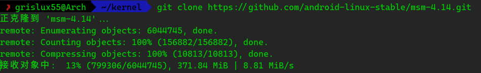
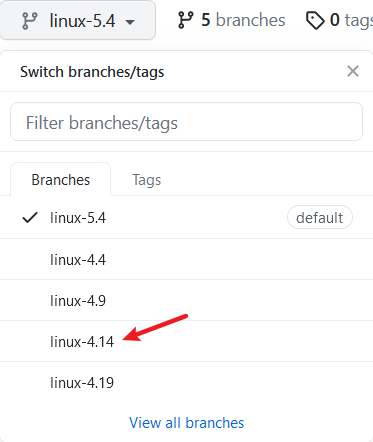
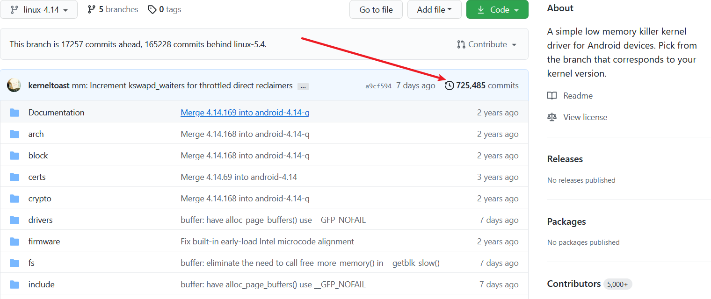
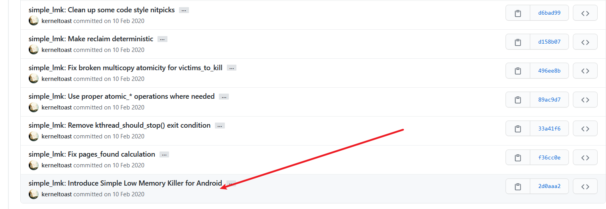
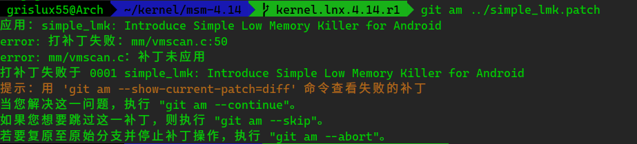
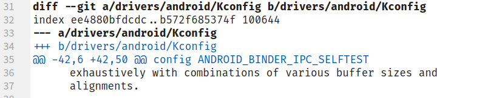
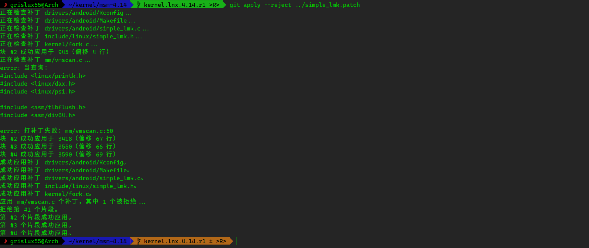
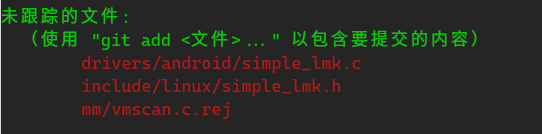
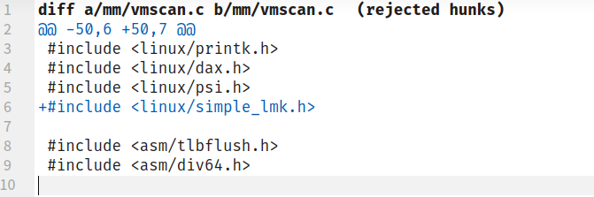

# 三、修改内核——添加

## 准备步骤

#### 1. 一个内核

这里不采用具体的设备内核，因为具体设备的情况可能会略有不同，根据情况稍微变通即可。

示例所采用的内核：[Android Linux Stable](https://github.com/android-linux-stable/msm-4.14)

将内核Clone下来：



#### 2. 另一个内核（或者别的为内核提供功能的补丁集之类的）

这里采用著名的内核开发者[Sultan Alsawaf](https://github.com/kerneltoast)的[simple_lmk](https://github.com/kerneltoast/simple_lmk)，为了匹配内核版本，我们选择4.14分支



## 分析

#### 1. 查看提交

点击commits数，查看以时间排序的提交：



#### 2. 分析提交

根据提交说明，我们定位到了这一次要操作的主角：



## 提取并应用补丁

#### 1. 下载补丁

Github为我们提供了一种快速地获取提交的补丁的方法——在网址的最后加上.patch：


当然也有一个TamperMonkey脚本适用于这种情况：[Github_Commit_Diff](https://github.com/jerone/UserScripts/tree/master/Github_Commit_Diff#readme)

接下来我们将补丁下载下来，或者复制下来，放到一个文件里去。

>   *在本教程中，我将patch放在内核的上级目录中，命名为simple_lmk.patch，如果你的文件路径或命名不一样，请记得将命令修改成对应的命令*

#### 2. 使用am以在不改变Authorship的情况下应用补丁

>   Authorship，即软件著作权。由于这些补丁并不是属于你的原创补丁，请一定一定不要破坏别人的著作权，很多人对此非常看重，随意破坏别人的著作权是非常不尊重人的行为！

执行命令：

```bash
git am ../simple_lmk.patch
```



oh！出问题了。

为什么会出现这样的情况呢？

我们回到Git生成的patch的格式来。



可以看到，Git在此处记录了更改的文件，紧跟其后使用了一个@@，声明了它要搜索的内容，然后在其后使用-或者+表示要更改的内容。

问题就出在这里！

出于某些原因，Git要搜索的内容被本地仓库中已有的更新的提交给覆盖掉了，所以我们要手动模拟Git打patch的行为，去做出打好patch的文件。

#### 3. 使用apply

首先要注意到一个事，那就是在只有某一部分的patch不能被Git正确应用的时候，Git依旧会阻止我们应用整个patch，所以我们应该使用apply将可以应用的patch先应用上。

命令如下（--reject代表将冲突的放在另一个文件里，先把没有错误的应用上）：

```bash
git apply --reject ../simple_lmk.patch
```



可以看到我们只有一个片段被阻止了。

使用

```bash
git status
```

查看详情：



这里的.rej结尾的文件就是没有应用上的补丁，这里需要我们手动应用。

#### 4. 修复冲突

使用你的文本编辑器查看.rej结尾的文件内容：



意思很显然，在`mm/vmscan.c`的`#include <linux/psi.h>`后面加一行`#include <linux/simple_lmk.h>`

为什么会出错呢？

仔细观察可以发现，在原来的`mm/vmscan.c`里面没有`#include <linux/psi.h>`，所以Git也就找不到要在哪里插入了。

由于`#include`指令的特性，在头部的位置并不会影响效果，所以直接找个地方扔进去就是。

#### 5. 清理并提交

应用完所有的patch之后，我们清理掉生成的.rej文件，然后使用

```bash
git add . && git am --continue
```

来应用所有更改。

## 后处理

simple_lmk在这里是不是就已经添加好了呢？

并没有，simple_lmk并不是单个commit组成的，它还有很多的后续修复，应该将它们一一下载下来打上去。

同时，仅仅将功能添加到内核上是不够的，某些功能只是提供了开关，要启用它们，需要在你的设备的配置文件中启用它们。

通过形如[启用slmk](https://github.com/kerneltoast/android_kernel_google_wahoo/commit/44aaacc5491fc4a350dcc91882287d468212c85b#diff-725dee1b5969e869d347d824338588038e684a18c72a5e7afd1fe76c296618ec)的更改，来为你要编译的内核启用这些功能。

